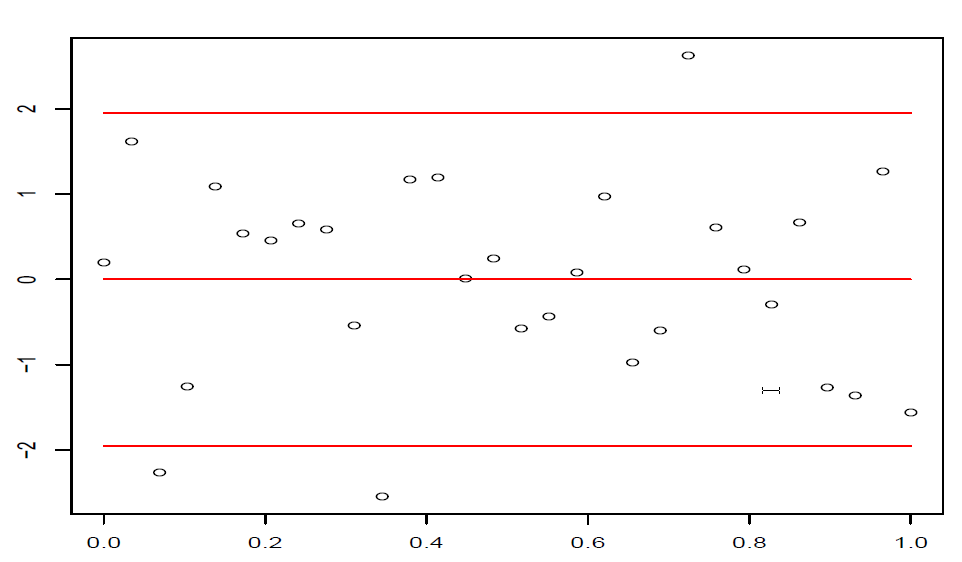
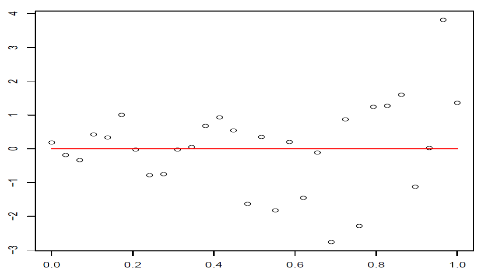
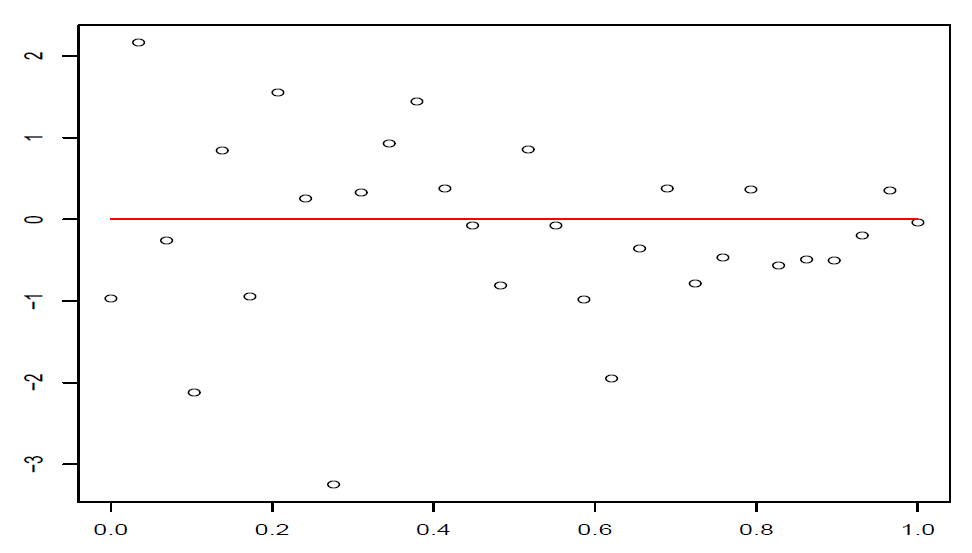
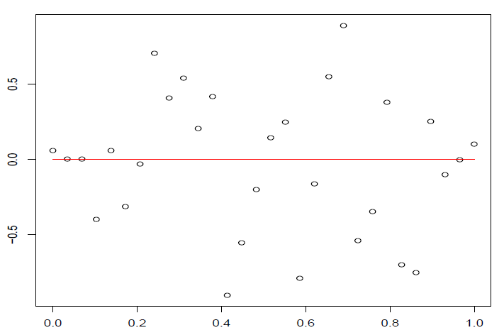
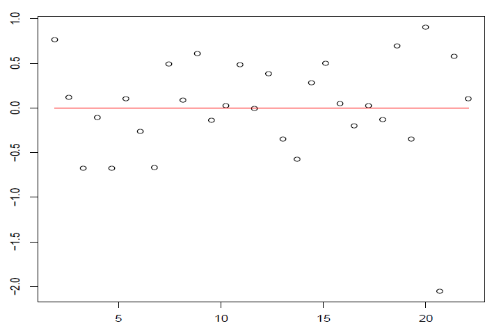
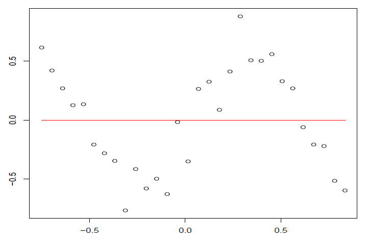
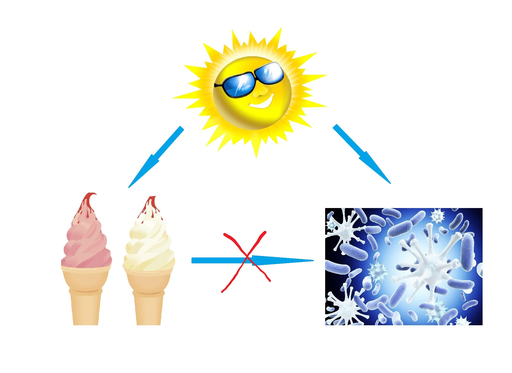

```{r setup, include=FALSE}
knitr::opts_chunk$set(echo = FALSE, message=FALSE, warning=FALSE)
```

## Simple Linear Models

The linear model is given by
$$y_i=\beta_0+\beta_1x_i+\epsilon_i,\ i=1,\dots,n.$$

- $\epsilon_i$ are random (need some assumptions)
- $x_i$ are **fixed** (*independent/predictor* variable)
- $y_i$ are random (*dependent/response* variable)
- $\beta_0$ is the *intercept*
- $\beta_1$ is the *slope*

## Least square estimators

Choose $\beta_0,\beta_1$ to minimize
$$Q(\beta_0,\beta_1) = \sum_{i=1}^n(y_i-\beta_0-\beta_1x_i)^2.$$

The minimizers $\hat\beta_0,\hat\beta_1$ are given by

$$\hat\beta_1 = \frac{\sum_{i=1}^n(y_i-\bar y)x_i}{\sum_{i=1}^n(x_i-\bar x)x_i},\ \hat\beta_0=\bar y-\hat\beta_1\bar x.$$

`Regression function`: $\hat y=\hat\beta_0+\hat\beta_1x$.

## Some useful  notations

$$\ell_{xx} = \sum_{i=1}^n(x_i-\bar x)^2$$ $$\ell_{yy} = \sum_{i=1}^n(y_i-\bar y)^2$$ $$\ell_{xy} = \sum_{i=1}^n(x_i-\bar x)(y_i-\bar y)$$ 

$$\hat\beta_1 = \frac{\sum_{i=1}^n(y_i-\bar y)(x_i-\bar x)}{\sum_{i=1}^n(x_i-\bar x)(x_i-\bar x)}=\frac{\ell_{xy}}{\ell_{xx}}=\frac{1}{\ell_{xx}}\sum_{i=1}^n(x_i-\bar x)y_i$$

## Expected values and variances

`Assumption A1`: $E[\epsilon_i]=0,i=1,\dots,n$. 

`Theorem 1`: Under Assumption A1, $\hat\beta_0,\hat\beta_1$ are unbiased estimators for $\beta_0,\beta_1$, respectively.

`Assumption A2`: $Cov(\epsilon_i,\epsilon_j)=\sigma^21\{i=j\}$. 

`Theorem 2`: Under Assumption A2, we have
$$Var[\hat\beta_0] = \left(\frac 1n+\frac{\bar x^2}{\ell_{xx}}\right)\sigma^2,\ Var[\hat\beta_1] =\frac{\sigma^2}{\ell_{xx}}$$

$$Cov(\hat\beta_0,\hat\beta_1) = \frac{-\bar x}{\ell_{xx}}\sigma^2.$$


## Estimation of $\sigma^2$

`Definition`: The sum of squared errors (SSE) is defined by
$$S_e^2 = \sum_{i=1}^n(y_i-\hat\beta_0-\hat\beta_1x_i)^2.$$

`Theorem 3`: Let
$$\hat{\sigma}^2 := \frac{Q(\hat \beta_0,\hat\beta_1)}{n-2}=\frac{\sum_{i=1}^n(y_i-\hat\beta_0-\hat\beta_1x_i)^2}{n-2}=\frac{S_e^2}{n-2}.$$
Under Assumptions A1 and A2, we have $E[\hat\sigma^2]=\sigma^2$.

## Normal distributions

`Assumption B`: $\epsilon_i\stackrel{iid}{\sim}N(0,\sigma^2),i=1,\dots,n$.

> Assumption B includes Assumptions A1 and A2.

`Theorem 4`: Under Assumption B, we have

(1). $\hat\beta_0\sim N(\beta_0,(\frac 1n+\frac{\bar x^2}{\ell_{xx}})\sigma^2)$

(2). $\hat\beta_1\sim N(\beta_1,\frac{\sigma^2}{\ell_{xx}})$

(3). $\frac{(n-2)\hat\sigma^2}{\sigma^2}=\frac{S_e^2}{\sigma^2}\sim \chi^2(n-2)$

(4). $\hat\sigma^2$ is independent of $(\hat\beta_0,\hat\beta_1)$.


## Inferences about $\beta_1$

For known $\sigma$ we can make tests and confidence
intervals using
$$\frac{\hat\beta_1-\beta_1}{\sigma/\sqrt{\ell_{xx}}}\sim N(0,1).$$

The $100(1-\alpha)\%$ confidence interval for $\beta_1$ is given by $$\hat\beta_1\pm u_{1-\alpha/2}\sigma/\sqrt{\ell_{xx}}.$$ 

For testing 
$$H_0:\beta_1=\beta_1^*\ vs.\ H_1:\beta_1\neq\beta_1^*,$$
we reject $H_0$ if $|\hat\beta_1-\beta_1^*|>u_{1-\alpha/2}\sigma/\sqrt{\ell_{xx}}$

## Inferences about $\beta_1$

In the more realistic setting of unknown $\sigma$,  using claims (2-4) gives
$$\frac{\hat\beta_1-\beta_1}{\hat{\sigma}/\sqrt{\ell_{xx}}}\sim t(n-2).$$
The $100(1-\alpha)\%$ confidence interval for $\beta_1$ is   $$\hat\beta_1\pm t_{1-\alpha/2}(n-2)\hat{\sigma}/\sqrt{\ell_{xx}}.$$ 

For testing 
$$H_0:\beta_1=\beta_1^*\ vs.\ H_1:\beta_1\neq\beta_1^*,$$
we reject $H_0$ if $|\hat\beta_1-\beta_1^*|>t_{1-\alpha/2}(n-2)\hat\sigma/\sqrt{\ell_{xx}}$.

## Inferences about $\beta_0$

Similarly, for drawing inferences about $\beta_0$, we can use $$\frac{\hat\beta_0-\beta_0}{\sigma\sqrt{1/n+\bar x^2/\ell_{xx}}}\sim N(0,1),$$
$$\frac{\hat\beta_0-\beta_0}{\hat\sigma\sqrt{1/n+\bar x^2/\ell_{xx}}}\sim t(n-2).$$

## Inferences about $\sigma^2$

The $100(1-\alpha)\%$ confidence interval for $\sigma^2$ is
$$\left[\frac{(n-2)\hat\sigma^2}{\chi_{1-\alpha/2}^2(n-2)},\frac{(n-2)\hat\sigma^2}{\chi_{\alpha/2}^2(n-2)}\right]$$
or, 
$$\left[\frac{S_e^2}{\chi_{1-\alpha/2}^2(n-2)},\frac{S_e^2}{\chi_{\alpha/2}^2(n-2)}\right].$$


## Case study 1

A manufacturer of air conditioning units is having assembly problems due to
the failure of a connecting rod to meet finished-weight specifications. Too many
rods are being completely tooled, then rejected as overweight. To reduce that
cost, the company’s quality-control department wants to quantify the relationship
between the weight of the **finished rod**, $y$, and that of the **rough casting**, $x$. Castings likely to produce rods that are too heavy can then be discarded
before undergoing the final (and costly) tooling process. 


## Graphed data

```{r,echo=FALSE}
rod = data.frame(
        id = seq(1:25),
        rough_weight = c(2.745, 2.700, 2.690, 2.680, 2.675, 2.670, 2.665, 
                         2.660, 2.655, 2.655, 2.650, 2.650, 2.645, 2.635,
                         2.630, 2.625, 2.625, 2.620, 2.615, 2.615, 2.615, 
                         2.610, 2.590, 2.590, 2.565),
     finished_weight = c(2.080, 2.045, 2.050, 2.005, 2.035, 2.035, 2.020, 
                         2.005, 2.010, 2.000, 2.000, 2.005, 2.015, 1.990, 
                         1.990, 1.995, 1.985, 1.970, 1.985, 1.990, 1.995, 
                         1.990, 1.975, 1.995, 1.955)
)
attach(rod)
par(mar=c(4,4,1,0.5))
plot(rough_weight,finished_weight,type="p",pch=16,
     xlab = "Rough Weight",ylab = "Finished Weight")
```


## Model setting

Consider the linear model
$$y_i=\beta_0+\beta_1x_i+\epsilon_i,\ \epsilon_i\stackrel{iid}{\sim}N(0,\sigma^2).$$

- The observed data gives $$\bar x = 2.643,\ \bar y=2.0048,\ell_{xx}=0.0367,\ \ell_{xy}=0.023565.$$
- The least square estimates are 
$$\hat\beta_1=\frac{\ell_{xy}}{\ell_{xx}}=\frac{0.023565}{0.0367}=0.642,\ \hat\beta_0=\bar y-\hat\beta_1\bar x=0.308.$$

- variance estimator: $\hat\sigma = 0.0113$
- The regession function $\hat y = 0.308+0.642 x$

## The results

```{r, echo=FALSE,fig.height=4.2}
par(mar=c(4,4,1,0.5))
plot(rough_weight,finished_weight,type="p",pch=16,
     xlab = "Rough Weight",ylab = "Finished Weight")
lm.rod = lm(finished_weight~rough_weight)
abline(coef(lm.rod),col="blue")

```


## Summary report


```{r}
summary(lm.rod) #output the results
```


## Assessing the Fit

As an aid in assessing the quality of the fit, we will make extensive use of the residuals,
which are the differences between the observed and fitted values:
$$\hat \epsilon_i = y_i-\hat\beta_0-\hat\beta_1x_i,\ i=1,\dots,n.$$

It is most useful to examine the residuals graphically. Plots of the residuals versus the
$x$ values may reveal systematic misfit or ways in which the data do not conform to
the fitted model. Ideally, the residuals should show no relation to the $x$ values, and the plot should look like a horizontal blur. 

## The graphed residuals

```{r}
par(mar=c(4,4,2,1))
plot(lm.rod$fitted.values,lm.rod$residuals,"p",
     xlab="Fitted values",ylab = "Residuals")
```


## Standardized residuals

```{r}
par(mar=c(4,4,2,1))
plot(lm.rod$fitted.values,rstandard(lm.rod),"p",
     xlab="Fitted values",ylab = "Standardized Residuals")
abline(h=c(-2,2),lty=c(5,5))

```


## Drawing Inferences about $E[y]$

For given $x$, we want to estimate the expected value of $y$, i.e., $E[y]=\beta_0+\beta_1x.$ A natural unbiased estimate is $\hat y = \hat\beta_0+\hat\beta_1x$.

`Theorem 5`: Suppose Assumption B is satisfied. Then we have 
$$\hat y = \hat\beta_0+\hat\beta_1x \sim N(\beta_0+\beta_1x,[1/n+(x-\bar x)^2/\ell_{xx}]\sigma^2).$$
A $100(1−\alpha)\%$ confidence interval for $E[y]=\beta_0+\beta_1x$ is
given by 
$$\hat y\pm t_{1-\alpha/2}(n-2)\hat{\sigma}\sqrt{\frac{1}{n}+\frac{(x-\bar x)^2}{\ell_{xx}}}.$$

## Case study 1: Confidence interval

```{r}
x = seq(2.5,2.8,by=0.001)
newdata = data.frame(rough_weight= x)
pred_x = predict(lm.rod,newdata,interval = "confidence")
par(mar=c(4,4,2,1))
matplot(x,pred_x,type="l",lty = c(1,5,5),
        col=c("blue","red","red"),lwd=2,
        xlab="Rough Weight",ylab="Finished Weight")
abline(v=mean(rough_weight),lty=5)
points(rough_weight,finished_weight,pch=16)
legend(2.5,2.1,c("Fitted","Lower limit","Upper limit"),
       lty = c(1,5,5),col=c("blue","red","red"))
```

## Drawing Inferences about $y$

We now give a **prediction interval** for the future observation $y$ rather than its expected value $E[y]$. Note that here $y$ is no longer a fixed parameter, which is assumed to be independent of $y_i$'s. 

`Definition`: A prediction interval is a range of numbers that
contains $y$ with a specified probability. 

`Theorem 6`: Suppose Assumption B is satisfied. Let $y=\beta_0+\beta_1x+\epsilon$, where $\epsilon\sim N(0,\sigma^2)$ is independent of $\epsilon_i$'s. A $100(1−\alpha)\%$ prediction interval for $y$ is
given by 
$$\hat y\pm t_{1-\alpha/2}(n-2)\hat{\sigma}\sqrt{1+\frac{1}{n}+\frac{(x-\bar x)^2}{\ell_{xx}}}.$$

## Case study 1: Prediction interval

```{r}
x = seq(2.5,2.8,by=0.001)
newdata = data.frame(rough_weight= x)
pred_x = predict(lm.rod,newdata,interval = "prediction")
par(mar=c(4,4,2,1))
matplot(x,pred_x,type="l",lty = c(1,5,5),
        col=c("blue","red","red"),lwd=2,
        xlab="Rough Weight",ylab="Finished Weight")
abline(v=mean(rough_weight),lty=5)
points(rough_weight,finished_weight,pch=16)
legend(2.5,2.1,c("Fitted","Lower limit","Upper limit"),
       lty = c(1,5,5),col=c("blue","red","red"))
```


## How to control y?

Consider case study 1 again. Castings likely to produce rods that are too heavy can then be discarded before undergoing the final (and costly) tooling process. The company’s quality-control department wants to produce the rod $y$ with weights no large than 2.05 with probablity no less than 0.95. How to choose the rough casting? 

Now we want $y\le y_0=2.05$ with probability $1-\alpha$. Similarly to Theorem 6, we can construct one-side confidence interval for $y$, that is 
$$\bigg(-\infty,\hat y+t_{1-\alpha}(n-2)\hat{\sigma}\sqrt{1+\frac{1}{n}+\frac{(x-\bar x)^2}{\ell_{xx}}}\bigg].$$

## How to control y?


```{r,echo=FALSE,fig.height=4}
x = seq(2.5,2.8,by=0.001)
newdata = data.frame(rough_weight= x)
pred_x = predict(lm.rod,newdata,interval = "prediction")
par(mar=c(4,4,2,1))
singlebound = (pred_x[,1]-pred_x[,2])/qt(0.975,lm.rod$df)*qt(0.95,lm.rod$df)+pred_x[,1]
par(mar=c(4,4,2,1))
matplot(x,cbind(pred_x[,1],singlebound),type="l",lty = c(1,5),
        col=c("blue","red"),lwd=2,
        xlab="Rough Weight",ylab="Finished Weight")
points(rough_weight,finished_weight,pch=16)
abline(h=2.05,v=2.682,lty=c(5,5))
text(2.63,2.1,"the threshold is 2.682",col="red")
legend(2.5,2.12,c("Fitted","Upper limit"),
       lty = c(1,5),col=c("blue","red"))

```
$$\hat\beta_0+\hat\beta_1x+t_{1-\alpha}(n-2)\hat{\sigma}\sqrt{1+\frac{1}{n}+\frac{(x-\bar x)^2}{\ell_{xx}}}\le y_0$$

## Multiple linear regression

Consider a model of the form
$$y_i=\beta_0+\beta_1x_{i1}+\beta_2x_{i2}+\dots+\beta_{p-1}x_{i,p-1}+\epsilon_i,\ i=1,\dots,n.$$

In the matrix form:

$$
\left[
\begin{matrix}
y_1\\
y_2\\
\vdots\\
y_n
\end{matrix}
\right]
=
\left[
\begin{matrix}
1 & x_{11} & x_{12} & \cdots & x_{1,p-1}\\
1 & x_{21} & x_{22} & \cdots & x_{2,p-1}\\
\vdots & \vdots & \vdots & \vdots & \vdots & \\
1 & x_{n1} & x_{n2} & \cdots & x_{n,p-1}\\
\end{matrix}
\right]\left[
\begin{matrix}
\beta_0\\
\beta_1\\
\vdots\\
\beta_{p-1}
\end{matrix}
\right]+\left[
\begin{matrix}
\epsilon_1\\
\epsilon_2\\
\vdots\\
\epsilon_n
\end{matrix}
\right].
$$

$$Y=X\beta+\epsilon$$ 

- the matrix $X$ is called the **design matrix**

## Least squares estimation (LSE)

Find $\beta$ to minimize

$$
\begin{align}
Q(\beta)&=\sum_{i=1}^n(y_i-\beta_0-\beta_1x_{i1}-\dots-\beta_{p-1}x_{i,p-1})^2\\&=||Y-X\beta||^2=(Y-X\beta)^\top (Y-X\beta)\\
&=Y^\top Y-2Y^\top X\beta+\beta^\top X^\top X\beta.
\end{align}
$$

If we differentiate $Q$ with respect to each $\beta_i$ and set the derivatives equal to zero, we see that the minimizers $\hat\beta_0,\dots,\hat\beta_{p-1}$ satisfy 

$$\frac{\partial Q}{\partial \beta_i}=-2(Y^\top X)_i+2(X^{\top}X)_{i\cdot}\hat\beta=0.$$

## Normal equations

We thus arrive at the so-called **normal equations**:

$$X^\top X\hat\beta = X^\top Y$$

If the design matrix $X^\top X$ is **nonsingular**, the formal solution is
$$\hat\beta = (X^\top X)^{-1}X^\top Y.$$


`Lemma 1`: The matrix $X^\top X$ is nonsingular if and only if $\mathrm{rank}(X)=p$.

NOTE: In what follows, we assume that $\mathrm{rank}(X)=p<n$.  If $p>n$, it belongs to the field of [high-dimensional statistics](https://en.wikipedia.org/wiki/High-dimensional_statistic). 

## Expected values and variances

`Assumption A`: Assume that $E[\epsilon]=0$ and $Var[\epsilon]=\sigma^2I_n$.

 
`Theorem 7`: Suppose that Assumption A is satisfied and $\mathrm{rank}(X)=p<n$, we have 

(1). $E[\hat\beta]=\beta,$

(2). $Var[\hat\beta]=\sigma^2(X^\top X)^{-1}$.


## Estimation of $\sigma^2$

`Definition`: 

- **The fitted values**: $\hat Y = X\hat\beta$

- **The vector of residuals**: $\hat\epsilon = Y-\hat Y$

- **The sum of squared errors (SSE)**: $S_e^2=Q(\hat\beta)=||Y-\hat Y||^2=||\hat\epsilon||^2$

Note that 

$$\hat Y = X\hat\beta=X(X^\top X)^{-1}X^\top Y=:PY$$

- **The projection matrix**: $P = X(X^\top X)^{-1}X^\top$

The vector of residuals is then $\hat\epsilon=(I_n-P)Y$. 

## The projection matrix

Two useful properties of $P$ are given in the following lemma.

**The projection matrix**: $$P = X(X^\top X)^{-1}X^\top$$

`Lemma 2`: Let $P$ be defined as before. Then
$$P = P^\top=P^2$$

$$I_n-P = (I_n-P)^\top=(I_n-P)^2.$$


The sum of squared residuals is then 
$$
\begin{align}
S_e^2 := ||\hat \epsilon||^2 = Y^\top(I_n-P)^\top(I_n-P)Y=Y^\top(I_n-P)Y.
\end{align}
$$

## Estimation of $\sigma^2$

`Theorem 8`: Suppose that Assumption A is satisfied and $\mathrm{rank}(X)=p<n$, 
$$\hat\sigma^2 = \frac{S_e^2}{n-p}$$

is an unbiased estimate of $\sigma^2$.

## Normal distribution

`Assumption B`: Assume that $\epsilon\sim N(0,\sigma^2I_n)$.

`Theorem 9`: Suppose that Assumption B is satisfied and $\mathrm{rank}(X)=p<n$, we have

(1). $\hat\beta \sim N(\beta, \sigma^2(X^\top X)^{-1})$,

(2). $\frac{(n-p)\hat\sigma^2}{\sigma^2}=\frac{S_e^2}{\sigma^2}\sim \chi^2(n-p)$,

(3). $\hat\epsilon$ is independent of $\hat Y$,

(4). $S_e^2$ (or equivalently $\hat\sigma^2$) is independent of $\hat\beta$.


## Confidence intervals for $\beta_i$

Let $C=(X^\top X)^{-1}$ with entries $c_{ij}$. By Theorem 9, we have

$$\frac{\hat\beta_i-\beta_i}{\sigma\sqrt{c_{ii}}}\sim N(0,1),$$

$$\frac{\hat\beta_i-\beta_i}{\hat\sigma\sqrt{c_{ii}}}\sim t(n-p).$$


If $\sigma^2$ is known, the $100(1-\alpha)\%$ CI is

$$\hat\beta_i \pm u_{1-\alpha/2}\sigma\sqrt{c_{ii}}.$$

If $\sigma^2$ is unknown, for each $\beta_i$, the $100(1-\alpha)\%$ CI is

$$\hat\beta_i \pm t_{1-\alpha/2}(n-p)\hat\sigma\sqrt{c_{ii}}.$$

## Hypothesis tests on $\beta_i$

Consider the test

$$H_0:\beta_i= \beta_i^*\ vs.\ H_1:\beta_i\neq \beta_i^*.$$

The test statistic is 

$$T = \frac{\hat\beta_i-\beta_i^*}{\hat\sigma\sqrt{c_{ii}}}.$$


The rejection region is
$$W = \{|T|>t_{1-\alpha/2}(n-p)\}.$$

NOTE: We are particularly interested in the case of $\beta^*_i=0$.


## Significance tests

Consider the hypothesis test:

$$H_0:\beta_1=\dots=\beta_{p-1}=0\ vs.\ H_1: \beta_{i^*}\neq 0\text{ for some }i^*\ge 1.$$

`Definition`:  

- **The total sum of squares (SST)**: $S_T^2 = \sum_{i=1}^n(y_i-\bar Y)^2$

- **The sum of squares due to regression (SSR)**: $S_R^2  = \sum_{i=1}^n(\hat y_i-\bar Y)^2$

- **The sum of squared errors (SSE)**: $S_e^2 = \sum_{i=1}^n(y_i-\hat y_i)^2$

The relationship is 
$$S_T^2=S_R^2+S_e^2.$$

## The GLR test

The likelihood function for $Y$ is given by

$$L(\beta,\sigma^2) = (2\pi \sigma^2)^{-n/2} e^{-\frac{||Y-X\beta||^2}{2\sigma^2}}.$$

The  likelihood ratio is then given by

$$\lambda = \frac{\sup_{\theta\in\Theta}L(\beta,\sigma^2)}{\sup_{\theta\in\Theta_0}L(\beta,\sigma^2)} = \left(\frac{S_T^2}{S_e^2}\right)^{n/2}= \left(1+\frac{S_R^2}{S_e^2}\right)^{n/2}.$$


## F-tests

`Theorem 10`: Suppose that Assumption B is satisfied and $\mathrm{rank}(X)=p<n$, we have

(1). $S_R^2,S_e^2,\bar Y$ are independent, and

(2). if the null $H_0:\beta_1=\dots=\beta_{p-1}=0$  is true,
$$S_R^2/\sigma^2\sim\chi^2(p-1),$$

$$F=\frac{S_R^2/(p-1)}{S_e^2/(n-p)}\sim F(p-1,n-p).$$

We take $F$ as the test statistic. The rejection region is $W=\{F>F_{1-\alpha}(p-1,n-p)\}$.


## Coefficient of determination

`Definition`: The **coefficient of determination** is sometimes used as a crude measure of the strength of a relationship that has been
fit by least squares. This coefficient is  defined as 

$$R^2 =\frac{S_R^2}{S_T^2}=\frac{\sum_{i=1}^n(\hat y_i-\bar y)^2}{\sum_{i=1}^n(y_i-\bar y)^2}.$$
It can be interpreted as the proportion of the variability of the dependent variable that
can be explained by the independent variables.

It is easy to see that

$$F = \frac{S_T^2 R^2/(p-1)}{S_T^2(1-R^2)/(n-p)}=\frac{ R^2/(p-1)}{(1-R^2)/(n-p)}.$$

## Correlation coefficient

For the simple linear model $p=2$, we have 

$$S_R^2 = \sum_{i=1}^n(\hat y_i-\bar y)^2 = \hat\beta_1^2\sum_{i=1}^n(x_i-\bar x)^2 = \frac{\ell_{xy}^2}{\ell_{xx}}.$$
This gives
$$R^2 = \frac{\ell_{xy}^2}{\ell_{xx}\ell_{yy}} = \rho^2,$$
where the **correlation coefficient** between $x_i$ and $y_i$ is
$$\rho = \frac{\ell_{xy}}{\sqrt{\ell_{xx}\ell_{yy}}}=\frac{\sum_{i=1}^n(x_i-\bar x)(y_i-\bar y)}{\sqrt{\sum_{i=1}^n(x_i-\bar x)^2}\sqrt{\sum_{i=1}^n(y_i-\bar y)^2}}.$$

## Case study 2

It is found that the systolic pressure is linked to the weight and the age. We now have the following data.


```{r}
blood=data.frame(
weight=c(76.0,91.5,85.5,82.5,79.0,80.5,74.5,79.0,85.0,76.5,82.0,95.0,92.5),
age=c(50,20,20,30,30,50,60,50,40,55,40,40,20),
pressure=c(120,141,124,126,117,125,123,125,132,123,132,155,147))
plot(blood)
```


## Summary report

```{r}
lm.blood=lm(pressure~weight+age,data=blood)
summary(lm.blood)
```

## The regression function 

$$\hat y = -62.96336 + 2.13656 x_1+ 0.40022 x_2$$

- $R^2=0.9461$
- the estimated covariance matrix $\hat{\sigma}^2(X^\top X)^{-1}$ is

```{r}
n = length(blood$weight)
X = cbind(intercept=rep(1,n),weight=blood$weight,age=blood$age)
C = solve(t(X)%*%X)
SSE = sum(lm.blood$residuals^2) # sum of squared errors
# SST = var(blood$pressure)*(n-1)
# SSR = SST-SSE
# Fstat = SSR/(3-1)/(SSE/(n-3))
cov = SSE/(n-3)*C
knitr::kable(cov,caption = "")
```

## Confidence interval for $E[y_{n+1}]$ 

Consider

$$y_{n+1} = \beta_0+\beta_1x_{n+1,1}+\dots+\beta_{p-1}x_{n+1,p-1}+\epsilon_{n+1}.$$
Under Assumption B, $y_{n+1}=v^\top \beta+\epsilon\sim N(v^\top \beta,\sigma^2)$ , where $v = (1,x_{n+1,1},x_{n+1,2},\dots,x_{n+1,p-1})^\top$. An unbiased estimate of the expected value of $E[y_{n+1}]=v^\top \beta$ is the fitted value

$$\hat y_{n+1} = v^\top \hat\beta \sim N(v^\top \beta, \sigma^2 v^\top(X^\top X)^{-1}v).$$

The $100(1-\alpha)\%$ CI for $E[y_{n+1}]$ is 

$$\hat y_{n+1}\pm t_{1-\alpha/2}(n-p)\hat{\sigma}\sqrt{v^\top(X^\top X)^{-1}v}.$$

## Prediction interval for $y_{n+1}$

Similarly,

$$\frac{y_{n+1}-\hat y_{n+1}}{\hat{\sigma}\sqrt{1+v^\top(X^\top X)^{-1}v}}\sim t(n-p).$$

The $100(1-\alpha)\%$ prediction interval for $y$ is 

$$\hat y_{n+1}\pm t_{1-\alpha/2}(n-p)\hat{\sigma}\sqrt{1+v^\top(X^\top X)^{-1}v}.$$

## Case study 2

```{r}
newdata = data.frame(
        age = rep(31,100),
        weight = seq(70,100,length.out = 100)
)
CI = predict(lm.blood,newdata,interval = "confidence")
Pred = predict(lm.blood,newdata,interval = "prediction")
par(mar=c(4,4,2,1))
matplot(newdata$weight,cbind(CI,Pred[,-1]),type="l",lty = c(1,5,5,2,2),
        col=c("blue","red","red","brown","brown"),lwd=2,
        xlab="Weight",ylab="Pressure",main = "Age = 31")
legend(70,160,c("Fitted","Confidence","Prediction"),
       lty = c(1,5,2),col=c("blue","red","brown"))
```

## Case study 2


```{r}
newdata = data.frame(
        weight = rep(85,41),
        age = seq(20,60)
)
CI = predict(lm.blood,newdata,interval = "confidence")
Pred = predict(lm.blood,newdata,interval = "prediction")
par(mar=c(4,4,2,1))
matplot(newdata$age,cbind(CI,Pred[,-1]),type="l",lty = c(1,5,5,2,2),
        col=c("blue","red","red","brown","brown"),lwd=2,
        xlab="Age",ylab="Pressure",main = "Weight = 85")
legend(20,150,c("Fitted","Confidence","Prediction"),
       lty = c(1,5,2),col=c("blue","red","brown"))
```

## Extension to general models

**Inherently Linear models**:

$$\begin{align}
f(y) &= \beta_0+\beta_1 g_1(x_1,\dots,x_{p-1})+\dots\\&+\beta_{k-1} g_{k-1}(x_1,\dots,x_{p-1})+\epsilon
\end{align}$$

Let $y^*=f(y),\ x_i^*=g_i(x_1,\dots,x_{p-1})$. The transformed model is linear

$$y^*=\beta_0+\beta_1 x_1^*+\dots+\beta_{k-1} x_{k-1}^{*}+\epsilon.$$

## Examples

- Polynomial models: $$y = \beta_0+\beta_1x+\beta_2x^2+\beta_{p-1}x^p+\epsilon$$

- Interaction models: $$y = \beta_0+\beta_1x_1+\beta_2x_2^2+\beta_{3}x_1x_2+\epsilon$$

- Multiplicative models: $$y = \gamma_1X_1^{\gamma_2}X_2^{\gamma_3}\epsilon^*$$

- Exponential models: $$y = \exp\{\beta_0+\beta_1x_1+\beta_2x_2\}+\epsilon^*$$

## Examples

- Reciprocal models: $$y=\frac{1}{\beta_0+\beta_1x+\beta_2x^2+\beta_{p-1}x^p+\epsilon}$$

- Semilog models: $$y = \beta_0+\beta_1\log(x)+\epsilon$$

- Logit models: $$\log\left(\frac{y}{1-y}\right) = \beta_0+\beta_1 x+\epsilon$$

- Probit models: $\Phi^{-1}(y) = \beta_0+\beta_1 x+\epsilon$, where $\Phi$ is the CDF of $N(0,1)$.


## 回归诊断

回归分析都是基于误差项的假定进行的，最常见的假设$$\epsilon_i\stackrel{iid}{\sim}N(0,\sigma^2).$$

- 如何考察数据基本上满足这些假设？自然从残差的角度来解决问题，这种方法叫**残差分析**。

- 研究那些数据对统计推断（估计、检验、预测和控制）有较大影响的点，这样的点叫做**影响点**。剔除那些有较强影响的异常/离群(outlier)数据，这就是所谓的影响分析(influence analysis).

残差的定义为
$$\hat\epsilon = Y-\hat Y$$


## 残差的性质

在假设$\epsilon\sim N(0,\sigma^2I_n)$下，

1. $\hat\epsilon \sim N(0,\sigma^2(I_n-P))$

2. $Cov(\hat Y,\hat\epsilon) = 0$

3. $1^\top\hat\epsilon = 0$

从中可以看出，$Var[\hat\epsilon_i] = \sigma^2(1-p_{ii})$, 其中$p_{ij}$为投影矩阵的元素。该方差与$\sigma^2$以及$p_{ii}$有关，因此直接比较残差$\hat\epsilon_i$是不恰当的。

为此，将残差标准化：

$$\frac{\hat\epsilon_i-E[\hat\epsilon_i]}{\sqrt{Var[\hat\epsilon_i}]}= \frac{\hat\epsilon_i}{\sigma\sqrt{1-p_{ii}}},\ i=1,\dots,n$$


## 学生化残差

由于$\sigma$是未知的，所以用$\hat\sigma$来代替，其中$\hat\sigma^2 = S_e^2/(n-p)$. 于是得到学生化(studentized residuals)

$$t_i = \frac{\hat\epsilon_i}{\hat{\sigma}\sqrt{1-p_{ii}}}$$

- $t_i$虽然是$\hat\epsilon_i$的学生化，但它的分布并不服从$t$分布，它的分布通常比较复杂

- $t_1,\dots,t_n$通常是不独立的

- 在实际应用中，可以近似认为：$t_1,\dots,t_n$是相互独立，服从$N(0,1)$分布

- 在实际应用中使用的残差图就是根据上述假定来对模型合理性进行诊断的。


## 残差图

残差图：以残差为纵坐标，其他的量（一般为拟合值$\hat y_i$）为横坐标的散点图。

由于可以近似认为：$t_1,\dots,t_n$是相互独立，服从$N(0,1)$分布，所以可以把它们看作来自$N(0,1)$的iid样本

根据标准正态的性质，大概有$95\%$的$t_i$落入区间$[-2,2]$中。由于$\hat Y$与$\hat\epsilon$不相关，所以$\hat y_i$与学生化残差$t_i$的相关性也很小。

这样在残差图中，点$(\hat y_i,t_i),i=1,\dots,n$大致应该落在宽度为4的水平带$|t_i|\le 2$的区域内，且**不呈现任何趋势**。

## 残差图（1）

```{r, out.width='90%', fig.cap='正常的残差图'}

```

## 残差图（2）

```{r, out.width='90%', fig.cap='误差随着横坐标的增加而增加'}

```

## 残差图（3）

```{r, out.width='90%', fig.cap='误差随着横坐标的增加而减少'}

```

## 残差图（4）

```{r, out.width='90%', fig.cap='误差中间大，两端小'}

```

## 残差图（5）

```{r, out.width='90%', fig.cap='回归函数可能非线性，或者误差相关或者漏掉重要的自变量'}

```

## 残差图（6）

```{r, out.width='90%', fig.cap='回归函数可能非线性'}

```


## 残差图诊断的思路

- 如果残差图中显示误差方差不相等(heterogeneity, 方差非齐性)，可以对变量做适当的变换，使得变换后的相应变量具有近似相等的方差(homogeneity, 方差齐性)。最著名的方法是**Box-Cox变换**，见综述论文：

R. M. Sakia. The Box-Cox Transformation Technique: A Review. The Statistician, 41: 169-178, 1992.

- 如果残差图中显示非线性，可适当增加自变量的二次项或者交叉项。具体问题具体分析。

## 离群值(outlier)

产生离群值的原因：

1. 主观原因：收集和记录数据时出现错误

2. 客观原因：重尾分布（比如，$t$分布）和混合分布


离群值的简单判断：

1. 数据散点图

2. 学生化残差图，如果$|t_i|>3$ (或者2.5,2)，则对应的数据判定为离群值。

3. 离群值的统计检验方法，M-估计(Maximum likelihood type estimators)

## 案例

Anscombe在1973年构造了4组数据，每组数据都是由11对点$(x_i,y_i)$组成，试分析4组数据是否通过回归方程的检验。

```{r}
data("anscombe")
knitr::kable(t(anscombe),format = "markdown")
```

## 回归结果

```{r}
coef.list = list()
for(i in 1:4)
{
  ff = as.formula(paste0("y",i,"~","x",i))
  lmi = lm(ff,data = anscombe)
  
  coef.list = c(coef.list, list(summary(lmi)$coef))
}

print(coef.list)
```


## 回归直线

```{r}
par(mfrow = c(2,2),mar=c(4,4,1,1)+.1,oma=c(0,0,2,0))

for(i in 1:4)
{
  ff = as.formula(paste0("y",i,"~","x",i))
  lmi = lm(ff,data = anscombe)
  plot(ff,data = anscombe,col="red",pch = 21,bg="orange",
       cex = 1.2,xlim=c(3,19),ylim=c(3,13))
  abline(coef(lmi),col="blue")
}

```

## 残差

```{r}
par(mfrow = c(2,2),mar=c(4,4,1,1)+.1,oma=c(0,0,2,0))

for(i in 1:4)
{
  ff = as.formula(paste0("y",i,"~","x",i))
  lmi = lm(ff,data = anscombe)
  plot(lmi$fitted.values,rstandard(lmi),pch = 21,bg="orange",cex = 1.2,xlim=c(3,15),ylim=c(-4,4),xlab = "fitted values",ylab = "standardized residuals")
  abline(h=c(-3,3),lty=2)
}

```


## 异常值

```{r}
lm1 = lm(y1~x1,data = anscombe)
x = c(anscombe$x1, 18)
y = c(anscombe$y1,30)
lm.xy = lm(y~x)
plot(x,y,pch = 21,bg=c(rep("black",11),"red"),ylim=c(0,50))
abline(coef(lm.xy),lty=2,col="red")
abline(coef(lm1),lty=2,col="blue")
```

## 残差图

```{r}
par(mfrow = c(1,2),mar=c(4,4,1,1)+.1,oma=c(0,0,2,0))
plot(c(fitted(lm1),fitted(lm.xy)),c(rstandard(lm1),rstandard(lm.xy)),
     ylim=c(-3,3),pch = c(rep(21,11),rep(22,12)),
     bg = c(rep("blue",11),rep("red",12)),
     xlab = "fitted values",
     ylab="standardized residuals")
abline(h=c(-2,2),lty=2)
plot(lm.xy,3)
```

## 回归分析的其他内容

- 共线性(collinear)分析，岭回归(ridge regression)方法

- 变量选择方法：向前/后回归法、逐步回归法、完全子集法、交叉核实(cross validation)法，见课本P208-214

- 现代变量选择方法：LASSO (Least Absolute Shrinkage & Selection Operator)

## LASSO

```{r, out.width='25%', fig.cap='Rob Tibshirani'}
knitr::include_graphics('rob.jpg')
```
[https://statweb.stanford.edu/~tibs/](https://statweb.stanford.edu/~tibs/)

LASSO是斯坦福大学统计系Tibshirani于1996年发表的著名论文"[Regreesion shrinkage and selection via the LASSO](http://statweb.stanford.edu/~tibs/lasso/lasso.pdf)" (Journal of Royal Statistical Society, Seriers B, 58, 267-288)中所提出的一种变量选择方法。


## 回归分析与因果分析

即使建立了回归关系式并且统计检验证明相关关系成立，也只能说明研究的变量是统计相关的，而**不能就此断定变量之间有因果关系**。


案例(Ice Cream Causes Polio)：小儿麻痹症疫苗发明前，美国北卡罗来纳州卫生部研究人员通过分析冰淇淋消费量和小儿麻痹症的关系发现当冰淇淋消费量增加时，小儿麻痹疾病也增加。州卫生部发生警告反对吃冰淇淋来试图阻止这种疾病的传播。

## 没有观察的混杂因素——温度


Polio and ice cream consumption both increase in the summertime. Summer is when the polio virus thrived.

```{r, out.width='65%',fig.cap="The danger of mixing up causality and correlation"}

```


